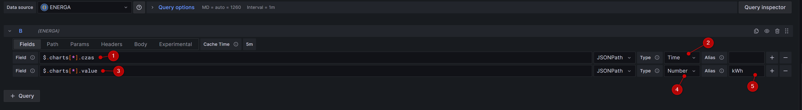
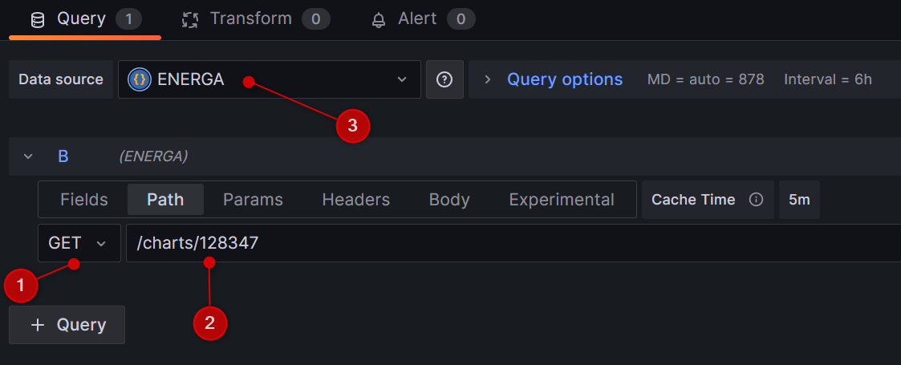
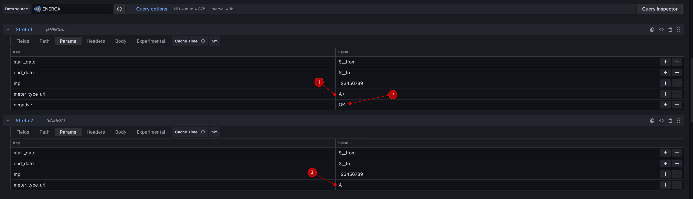
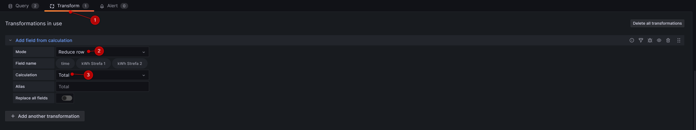

[](https://www.home-assistant.io/)
# [Energa meter](https://github.com/tcich/ha-addon-energa-meter) Home Assistant add-on
# Wersja dev
[aarch64-shield]: https://img.shields.io/badge/aarch64-yes-green.svg
[amd64-shield]: https://img.shields.io/badge/amd64-yes-green.svg
[armv6-shield]: https://img.shields.io/badge/armv6-yes-green.svg
[armv7-shield]: https://img.shields.io/badge/armv7-yes-green.svg
[i386-shield]: https://img.shields.io/badge/i386-yes-green.svg
![aarch64-shield]
![amd64-shield]
![armv6-shield]
![armv7-shield]
![i386-shield]


[kawa-logo]: https://github.com/tcich/ha-addon-energa-meter/blob/main/img/buycoffeeto-btn-primary-outline.png
[kawa]: https://buycoffee.to/tcich

<a href="https://buycoffee.to/tcich"></a>

## O dodatku

To jest dodatek dla [Home Assistant](https://www.home-assistant.io/). Instalacja dodatku [Energa meter](https://github.com/tcich/ha-addon-energa-meter) umożliwia cykliczne pobieranie danych z aplikacji [Mój Licznik - Energa](https://mojlicznik.energa-operator.pl) udostępnianej klientom Operatora energetycznego Energa.

### Wersja dev
Wersja dev jest wersją developeską, nie należy jej używać w produkcyjnej wersji HA, może powodować różne problemy, może nie działać.

## Instalacja
1) Dodaj repozytorium do repozytoriów dodatków swojego HA za pomocą poniższego przycisku

[](https://my.home-assistant.io/redirect/supervisor_add_addon_repository/?repository_url=https%3A%2F%2Fgithub.com%2Ftcich%2Fha-addon-energa-meter)

Lub zainstaluj manualnie z Ustawienia -> Dodatki -> Sklep z dodatkami -> ⁞ (Menu) -> Repozytoria -> Wpisz `https://github.com/tcich/hassio-mojlicznik` -> Dodaj. Następnie w ⁞ (Menu) -> Sprawdź aktualizacje (może być konieczne przeładowanie strony)

2) Odszukaj dodatek na liście dodatków w sklepie z dodatkami i zainstaluj go.

3) W zakładce konfiguracja uzupełnij nazwę użytkownika oraz hasło do aplikacji Mój Licznik, jeżeli potrzebujesz to zmień udostępniany port dla API

4) Przejdź do zakładki informacje i uruchom dodatek (pierwsze uruchomienie może trwać kilkanaście minut), jeżeli w logu pojawi się informacja *INFO: Czekam...* oznacza to, że pierwsze inicjalne pobieranie danych zostało ukończone.


## Wersja Docker
Aby ruchomić wersję docker należy skorzystać z polecenia poniżej

```
docker run -p 8000:8000 -e ENERGA_USERNAME=LoginEnerga  -e ENERGA_PASSWORD=HasloEnerga tomcic/energa-meter:v1.0.0
```

Wymagane parametry:

* ENERGA_USERNAME - nazwa użytkownika w aplikacji Energa Mój licznik
* ENERGA_PASSWORD - hasło użytkownika w aplikacji Energa Mój licznik


## Konfiguracja sensorów
Do HA możesz dodać sensory, które zawierają informacje udostępniane przez API

Poniższa instrukcja zawiera założenia:
* dodatek jest dostępny pod adresem *localhost* na porcie *8000*
* ID Twojego licznika to *123456789*

1) Ustal ID Twoich liczników, w tym celu przejdź do adresu Twojego HA na porcie 8000 lub innym jeźeli zmieniłeś go w konfiguracji, np. http://192.168.1.10:8000 wyświetli się w formacie json lista dostępnych liczników.
2) W pliku configuration.yaml w HA dodaj następującą konfigurację np.:

```
sensor:
  - platform: rest
    resource: http://localhost:8000/123456789/A%2B/1
    name: "A+ Taryfa 1"
    unique_id: 123456789_apt1
    unit_of_measurement: "kWh"
    value_template: "{{ value_json.countner.meter_value | round(2) }}"   
  - platform: rest
    resource: http://localhost:8000/123456789/A%2B/2
    name: "A+ Taryfa 2"
    unique_id: 123456789_apt2
    unit_of_measurement: "kWh"
    value_template: "{{ value_json.countner.meter_value | round(2) }}"       
```    

### Opis konfiguracji
| element konfiguracji | Opis |
|-------------------|-------------------|
| resource: http://localhost:8000/123456789/A%2B/1     | Adres API z danymi konkretnego licznika, podajemy **localhost** lub nazwę instancji dockera (**Nazwa hosta** z okna dodatku), port, id licznika, rodzaj pomiaru, taryfa|
| name: "A+ Taryfa 1"    | Nazwa sensora, wpisz dowolną|
| unique_id   | Unikalny ID sensora, nie mogą być w systemie dwa sensory z tym samym ID|
| unit_of_measurement: "kWh"   | Jednostka miary, nie zmieniaj chyba, że wiesz co robisz|
| value_template: "{{ value_json.meter.countner.meter_value \| round(2) }}"   | Zaokrąglony do dwóch miejsc po przecinku stan sensora|

## API dla wykresów, np. Grafana
Aby pobrać dane z API w formacie JSON należy użyć adresu http://home_assistant:8000/charts/12729?start_date=1695332400129&end_date=1697924583285&mp=123456789&zone=1

### Opis konfiguracji
| element konfiguracji | Opis |
|-------------------|-------------------|
| resource: http://localhost:8000/charts     | Adres API z danymi do wykresów, podajemy **localhost** lub nazwę instancji dockera (**Nazwa hosta** z okna dodatku), port, id licznika, rodzaj pomiaru, taryfa|
| start_date | data początkowa danych w formacie epoch (ms), domyślnie czas bieżący |
| end_date | data końcowa danych w formacie epoch (ms), domyślnie czas bieżący - 1 dzień |
| mp | numer licznika |
| meter_type_url | typ licznika (np. A+: A%2B, A-: A- ) |
| zone | numer strefy (np. 1, 2) |
| negative | dodanie parametru z dowolną wartością powoduje, że pomiar jest wartością ujemną|

## Jak dodać wykres do Grafana
### Źródło danych
1) Dodajemy źródło danych Home -> Data sources - Add new datasources: Wyszukujemy JSON API (jeżeli nie ma to musimy dodać)
2) NAME: ENERGA (1)
3) URL: http://twoj_addon:8000 (2)
4) Klikamy Save&test (3)
5) Uwaga: Jeżeli Grafana jest addonem w HA użyj właściwej nazwy hosta dostępnej w docker.


### Dashboard
1) Przechodzimy do Dashboards
2) Klikamy New -> New dashboard -> Add visualization
3) Wskazujemy Data source: ENERGA
4) W **Path** wpisujemy: GET: /charts

 (id Twojego licznika)
5) W **Fields** wpisujemy \$.charts\[\*\].czas typu Time oraz $.charts[*].value typu number z aliasem kWh
5) W **Params** wpisujemy Key: start_date Value: $__from
6) W **Params** wpisujemy Key: end_date Value: $__to






7) W **Params** wpisujemy Key: meter_type_url Value: A+ lub A- jeżeli mamy energię pobieraną i oddawaną, w takim przypadku tworzymy również oddzielne **Query** dla A+ i A-


8) W **Params** wpisujemy Key: negative Value: OK (może być dowolna wartość) jeżeli chcemy aby wykres był z wartościami ujemnymi (poniżej osi X)



9) W **Params** aby uzyskać bilans energii należy dodać **Transform**, przy czym wartość energii oddawanej powinna być jako energia ujemna (parametr negative)




## Znane problemy
* Czasami w aplikacji Mój Licznik włącza się captha (jeżeli masz dużo danych historycznych lub wielokrotnie instalujesz dodatek) - należy poczekać kilka godzin, problem rozwiąże się sam

## Uwagi
Dostęp do aktualnej wersji API nie jest zabezpieczony tokenem
Każde przeinstalowanie dodatku pobiera ponownie dane z aplikacji Mój Licznik

<a href="https://buycoffee.to/tcich"></a>

